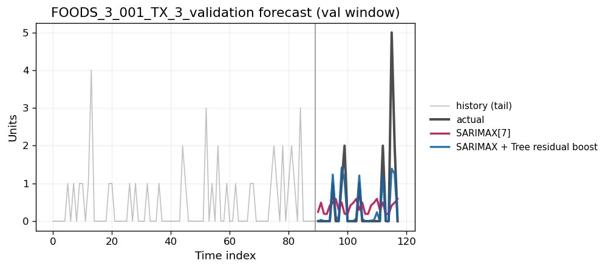
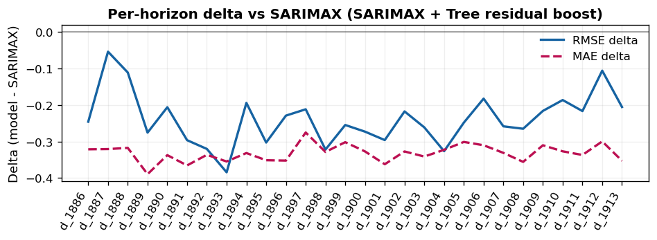
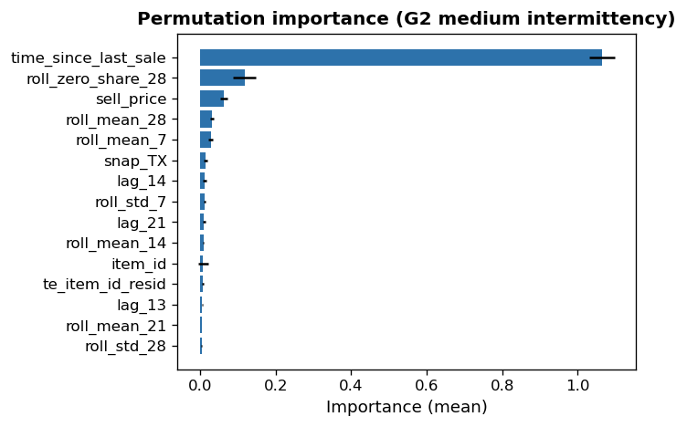

# SARIMAX Residual Stack

Hybrid forecasting that stacks machine learning models on top of SARIMAX residuals
to improve multi-horizon accuracy, especially across intermittent demand groups.

## Highlights

- Residual stacking over SARIMAX baselines with multiple learners (HGB, XGB, MLP, trees).
- Per-group evaluation to capture intermittency regimes.
- Ready-made plots and CSVs for quick reporting.

## Visuals

Residual Tree Boosting vs SARIMAX (same item, same horizon). The boosted model should
track the actuals more closely and reduce systematic errors.



Impact by forecast horizon (delta in error after boosting). Negative values indicate
improved performance from residual stacking.



Per-intermittency group explainability (feature importance example).



## Quickstart

1. Put your dataset inside `data/` (not tracked by git).
2. Run training:

```bash
python scripts/train.py
```

Optional helpers:

```bash
python scripts/run_pipeline.py
python scripts/run_test_eval.py
python scripts/per_group_models.py
```

## Results

Key outputs are saved in `results/`:

- `results/boosting/` residual-boosting metrics and comparisons
- `results/metrics/` baseline metrics for SARIMAX and naive methods
- `results/plots/` visual comparisons and horizon deltas
- `results/per_group_models/` per-intermittency group metrics and plots

## Project layout

- `scripts/` entry points for training, evaluation, and group-level modeling
- `src/` core data prep, models, evaluation, and plots
- `results/` metrics, plots, and exported CSVs
- `data/` local datasets (ignored)

## Data

The `data/` directory is intentionally excluded to keep the repo lightweight and
within GitHub file size limits. Use Git LFS or an external store if you need to
version large datasets.
